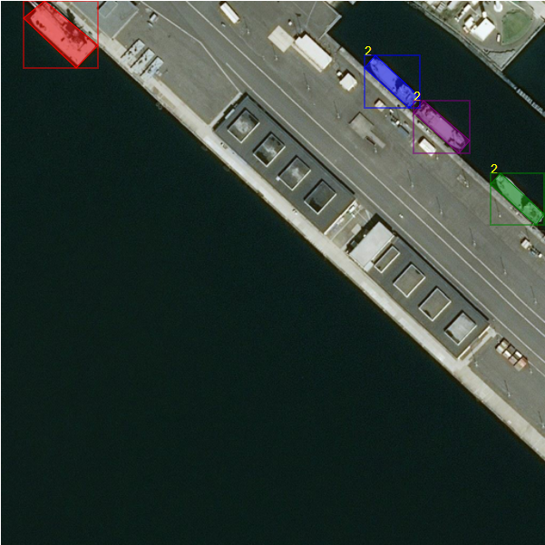
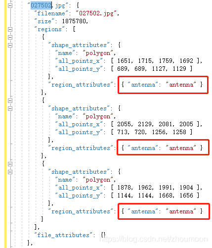

**背景**

万事开头难。之前写图像识别的博客教程，也是为了方便那些学了很多理论知识，却对实际项目无从下手的小伙伴，后来转到目标检测来了，师从烨兄、亚光兄，从他们那学了不少检测的知识和操作，今天也终于闲下了，准备写个检测系列的总结。一方面分享知识希望可以一起学习，另一方面让一部分人少走弯路，快速上路（入坑）。

此部分代码：[spytensor](https://github.com/spytensor/prepare_detection_dataset)
[Tony607](https://github.com/Tony607/labelme2coco)
[kaggle](https://www.kaggle.com/stargarden/coco-image-viewer)
博客地址: [目标检测系列一：如何制作数据集?](http://www.spytensor.com/index.php/archives/48/)

最后编辑整理by [zhoujianwen](https://zhoujianwen.blog.csdn.net/)

**更新**

- (28/03/2019)
    - 新增 `csv2labelme`
    
- (10/28/2020)
    - 新增 `txt2coco`

- (01/31/2021)
    - 新增 `voc2coco`
    
- (02/01/2021)
    - 新增 `vgg2coco`

<h4 id="1">1. 内容介绍</h4>

系列一主要介绍如何在常见的几种数据格式之间进行转换，以及万能中介`csv`格式的使用，这里列出以下几个：
- txt to coco
- csv to coco
- csv to voc
- labelme to coco
- labelme to voc
- csv to json
- voc to coco
- vgg to coco
<h4 id="2">2. 标准格式</h4>

在使用转换脚本之前，必须要明确的几种格式

<h5 id="2.1">2.1 csv</h5>

不要一看是`csv`文件就直接拿来运行，如果不是，可以自行修改代码，或者修改标注文件。

转换脚本支持的csv格式应为以下形式:

- `csv/`
    - `labels.csv`
    - `images/`
        - `image1.jpg`
        - `image2.jpg`
        - `...`

`labels.csv` 的形式: 

`/path/to/image,xmin,ymin,xmax,ymax,label`

例如:

```
/mfs/dataset/face/0d4c5e4f-fc3c-4d5a-906c-105.jpg,450,154,754,341,face
/mfs/dataset/face/0ddfc5aea-fcdac-421-92dad-144.jpg,143,154,344,341,face
...
```
注：图片路径请使用绝对路径

<h5 id="2.2">2.2 txt</h5>

数据集
链接：https://pan.baidu.com/s/1WN9ga-qD46y0Dok_2uQY1w 
提取码：mm32 

- `txt/`
    - `data/`
        - `train/images/`
             - `image1.jpg`
             - `image2.jpg`
             - `...`
        - `train/labels/`
             - `1.txt`
             - `2.txt`
             - `...`

`1.txt` 的格式：

```
4 586 459 577 441 646 410 654 428
...
```

转换之后：
`[nameOfImage, x1, y1, x2, y2, x3, y3, x4, y4, cls]`
```
['.\\data\\train\\labels\\1.tif', 586.0, 459.0, 577.0, 441.0, 646.0, 410.0, 654.0, 428.0, '4']
```

<h5 id="2.3">2.3 voc</h5>

标准的voc数据格式如下：

- `VOC2007/`
    - `Annotations/`
        - `0d4c5e4f-fc3c-4d5a-906c-105.xml`
        - `0ddfc5aea-fcdac-421-92dad-144/xml`
        - `...`
    - `ImageSets/`
        - `Main/`
            - `train.txt`
            - `test.txt`
            - `val.txt`
            - `trainval.txt`
    - `JPEGImages/`
        - `0d4c5e4f-fc3c-4d5a-906c-105.jpg`
        - `0ddfc5aea-fcdac-421-92dad-144.jpg`
        - `...`

<h5 id="2.4">2.4 coco</h5>

此处未使用测试集

- `coco/`
    - `annotations/`
        - `instances_train2017.json`
        - `instances_val2017.json`
    - `images/`
        - `train2017/`
            - `0d4c5e4f-fc3c-4d5a-906c-105.jpg`
            - `...`
        - `val2017`
            - `0ddfc5aea-fcdac-421-92dad-144.jpg`
            - `...`

<h5 id="2.5">2.5 labelme</h5>


- `labelme/`
    - `0d4c5e4f-fc3c-4d5a-906c-105.json`
    - `0d4c5e4f-fc3c-4d5a-906c-105.jpg`
    - `0ddfc5aea-fcdac-421-92dad-144.json`
    - `0ddfc5aea-fcdac-421-92dad-144.jpg`

Json file 格式:
（imageData那一块太长了，不展示了）

```json
{
  "version": "3.6.16",
  "flags": {},
  "shapes": [
    {
      "label": "helmet",
      "line_color": null,
      "fill_color": null,
      "points": [
        [
          131,
          269
        ],
        [
          388,
          457
        ]
      ],
      "shape_type": "rectangle"
    }
  ],
  "lineColor": [
    0,
    255,
    0,
    128
  ],
  "fillColor": [
    255,
    0,
    0,
    128
  ],
  "imagePath": "004ffe6f-c3e2-3602-84a1-ecd5f437b113.jpg",
  "imageData": ""   # too long ,so not show here
  "imageHeight": 1080,
  "imageWidth": 1920
}
```

<h4 id="3">3. 如何使用转换脚本</h4>

<h5 id="3.1">3.1 csv2coco</h5>
txt2coco.py配置操作请参考csv2coco.py

首先更改`csv2coco.py`中以下几个配置

```
classname_to_id = {"person": 1}  # for your dataset classes
csv_file = "labels.csv"  # annatations file path
image_dir = "images/"    # original image path
saved_coco_path = "./"   # path to save converted coco dataset
```

然后运行 `python csv2coco.py`

会自动创建文件夹并复制图片到相应位置，运行结束后得到如下：

- `coco/`
    - `annotations/`
        - `instances_train2017.json`
        - `instances_val2017.json`
    - `images/`
        - `train2017/`
            - `0d4c5e4f-fc3c-4d5a-906c-105.jpg`
            - `...`
        - `val2017`
            - `0ddfc5aea-fcdac-421-92dad-144.jpg`
            - `...`

<h5 id="3.2">3.2 csv2voc</h5>

首先更改`csv2voc.py`中以下几个配置

```
csv_file = "labels.csv"
saved_path = ".VOC2007/" # path to save converted voc dataset     
image_save_path = "./JPEGImages/"   # converted voc images path
image_raw_parh = "images/"          # original image path
```

然后运行 `python csv2voc.py`

同样会自动创建文件夹并复制图片到相应位置，运行结束后得到如下：


- `VOC2007/`
    - `Annotations/`
        - `0d4c5e4f-fc3c-4d5a-906c-105.xml`
        - `0ddfc5aea-fcdac-421-92dad-144/xml`
        - `...`
    - `ImageSets/`
        - `Main/`
            - `train.txt`
            - `test.txt`
            - `val.txt`
            - `trainval.txt`
    - `JPEGImages/`
        - `0d4c5e4f-fc3c-4d5a-906c-105.jpg`
        - `0ddfc5aea-fcdac-421-92dad-144.jpg`
        - `...`

<h5 id="3.3">3.3 labelme2coco</h5>

首先更改`labelme2coco.py`中以下几个配置

```
classname_to_id = {"person": 1}  # for your dataset classes
labelme_path = "labelme/"  # path for labelme dataset
saved_coco_path = "./"     # path for saved coco dataset
```
然后运行 `python labelme2coco.py`，生成文件形式同`csv2coco`

<h5 id="3.4">3.4 labelme2voc</h5>

首先更改`labelme2voc.py`中以下几个配置

```
labelme_path = "labelme/"  # path for labelme dataset
saved_coco_path = "./"     # path for saved coco dataset
```
然后运行 `python labelme2voc.py`，生成文件形式同`csv2voc`

<h5 id="3.5">3.5 csv2labelme</h5>

首先更改`csv2labelme.py`中以下几个配置

```
image_path = "./images/"  # path for images
csv_file = "./"     # path for csv annotations
```
然后运行 `python csv2labelme.py`，生成的`json`文件会保存在`image_path`下,切换路径过去,直接`labelme`便
可以查看标签.

<h5 id="3.6">3.6 coco数据可视化</h5>
数据路径默认配置

`annotation_path = "./outputscoco/annotations/instances_train2020.json"`
`image_dir = "./outputscoco/images/train2020"`

运行 `COCO_Image_Viewer.ipynb`
```python
html = coco_dataset.display_image(1, use_url=False)
IPython.display.HTML(html)
```


<h5 id="3.7">3.7 voc2coco</h5>

将 Pascal VOC 转换为 COCO annotation

获得带注释的XML和图像文件后，将它们放入以下与下面类似的文件夹结构中，

	rawdata
	 └── 20210131181727
		 ├── Annotations
		 │ 		├── 1.xml
		 │ 		├── ...
		 │ 		└── 20.xml
		 └── JPEGImages
			 	├── 1.jpg
			 	├── ...
			 	└── 20.jpg
然后，您可以像这样从我的GitHub运行voc2coco.py脚本，它将为您生成COCO数据格式的JSON文件。

	$vocFolderName = 20210131181727
	$cocoFolderName = format(datetime.now(), "%Y%m%d%H%M%S")
	python voc2coco.py ./rawdata/voc/$FolderName/Annotations ./convertedData/coco/$FolderName/annotations/instances_train$FolderName.json

COCO目录如下，其中你要手动将
./rawdata/20210131181727/JPEGImages 目录下所有*.jpg文件拷贝到
./convertedData/20210131224630/images

	convertedData
	 └── 20210131224630
		 ├── annotations
		 │ 	 ├── instances_train20210131224630.json
		 │ 
		 │ 
		 └── images
			 ├── 1.jpg
			 ├── ...
			 └── 20.jpg

<h5 id="3.8">3.8 vgg2coco</h5>

VGG Image Annotator to COCO annotation

使用```python vgg2coco.py```转换脚本之前，需要自行修改vgg2coco.py代码

主要修改文件读取和存储路径

vgg_json_file

json_file

path_images
```python
if __name__ == '__main__':
    vocFolderName = "202102010034"
    vgg_json_file = "./rawdata/voc/%s/%s" %(vocFolderName, "train2017.json")   # path_to_input_via_json_file
    saved_time = format(datetime.now(), "%Y%m%d%H%M%S")
    cocoFolderName = saved_time
    json_file = ('./convertedData/coco/%s/annotations/instances_train%s.json' % (cocoFolderName, cocoFolderName))  # path_to_output_coco_json_file
    path_images = "./rawdata/voc/202102010034/JPEGImages" # path_to_images
    via_to_coco(vgg_json_file, json_file, path_images)
```

另外你还需要依据vgg的train2017.json的region_attributes属性为即将要导出的新文件添加categories，例如其中027502.jpg的annotation内容如下




并依据标红的地方修改vgg2coco.py第104行代码，这个要根据你数据集的categories实现情况做修改就可以了。
    
    main_dict['categories'] = [{"id": 0,"name": "antenna"}]
    
完成上述修改之后就可以直接运行

    python vgg2coco.py

<h4 id="4">4. 万能中介csv</h4>

从上面的转换格式中可以看出，并没有给出如何转到csv的，一是因为太过于简单，而是主流检测框架很少支持这种格式的数据输入。以下给出如何将标注信息写入`csv`

```python
info = [[filename0,"xmin ymin xmax ymax label0"],
          filename1,"xmin ymin xmax ymax label1"]
csv_labels = open("csv_labels.csv","w")
for filename,bboxes in info:
    bbox = bboxes.split(" ")
    label = bbox[-1]
    csv_labels.write(filename+","+bbox[0]+","+bbox[1]+","+bbox[2]+","+bbox[3]+","+label+"\n")
csv_labels.close()
```

是不是非常简单。。。如果你不知道如何从原始的标签文件中读取得到标注信息，那没办法了，学学编程吧，23333

<h4 id="5">5. 下一篇</h4>
如何做数据增强？最近看了百度的paddlex，集成了不少数据增强的例子，为了节省宝贵的时间，建议参考一下。
